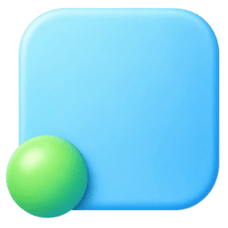

<div align="center">
  
  <h1>Dotlore</h1>
  <p>Sync your AI stuff and keep it away from your main codebase.</p>
  <p>
    <a href="https://github.com/dinhanhthi/dotlore">GitHub</a> ·
    <a href="https://github.com/dinhanhthi/dotlore/releases">Releases</a> ·
    <a href="CONTRIBUTING.md">Contributing</a>
  </p>
</div>

> [!NOTE]
> **macOS** is the only supported target. Windows and Linux are not in scope.

Dotlore tracks the AI-agent config your projects git-ignore and syncs it between your own Macs. Point it at any folder or single file you keep out of git — `.claude/`, `CLAUDE.md`, `.agents/`, your project's `docs/`, your global `~/.claude`, or whatever else you work with. Files stay where they are; nothing is moved, symlinked, or added to your project's git history.

## ✨ Features

- **Files stay put** — tracked roots are never moved, symlinked, or added to project git history.
- **Any folder or file** — `.claude/`, `CLAUDE.md`, `.agents/`, project `docs/`, `~/.claude`, or any other path you keep out of git.
- **Cloud folder, not a cloud API** — sync through iCloud Drive or Google Drive desktop, a folder path you already have.
- **Immutable bundles** — each Mac publishes its own git bundle; nothing in the cloud folder is rewritten or deleted.
- **Conflicts without markers** — the newer commit wins on every device; the loser's bytes stay beside it as a sibling file.
- **Desktop + menu bar** — one three-column window (sidebar, file tree, viewer/resolver) and a compact status item.
- **CLI included** — `dotlore` ships inside the app bundle for `add`, `sync`, `status`, and `daemon`.

## 🔄 How it works

Transport is a cloud folder you already sync (iCloud Drive or Google Drive desktop) — a folder path, never a cloud API.

Each tracked root gets a private staging git repo under `~/Library/Application Support/dotlore/`. Dotlore mirrors the root into staging, commits, and publishes an **immutable** git bundle to its own device directory in the cloud:

```
<cloud>/dotlore/<slug>/devices/<device-id>/000001.bundle
```

Two devices never write the same cloud file, and nothing there is ever rewritten or deleted. Incoming bundles are fetched and merged by the system `git` — so non-overlapping edits just merge.

Overlapping edits resolve deterministically: the newer commit wins on **every** device, and the loser's bytes are kept beside it as `<stem>.conflict-<device>-<blob>.<ext>`. No version is ever lost, no conflict markers are written into a live file, and all devices converge on the same tree.

## 💻 Platforms

**macOS** (desktop + menu bar) is the only supported target. Windows and Linux are not in scope. Encryption at rest, direct cloud APIs, and syncing session logs or caches are also out of scope — the threat model is "not in the project's git", not "hide from the cloud provider".

## 🛠️ Tech stack

| Layer    | Technology                                                                 |
| -------- | -------------------------------------------------------------------------- |
| Engine   | Rust workspace — `dotlore-core`, `dotlore-cli`, `dotlore-app`              |
| Git      | System `git` binary (no git library)                                       |
| App      | Tauri 2 + React 19 + TypeScript + Vite                                     |
| UI       | Tailwind CSS v4, shadcn/ui                                                 |
| Editor   | CodeMirror 6 (`@codemirror/merge` for conflicts)                           |
| Login    | macOS `launchctl`                                                          |

## 🚀 Development

**Prerequisites:** [Rust](https://rustup.rs/) 1.89+ (uses `std::fs::File::lock`), [Node.js](https://nodejs.org/) 20+, [pnpm](https://pnpm.io/), the system `git`, and the [Tauri prerequisites](https://v2.tauri.app/start/prerequisites/) for macOS. If `git` is missing, Dotlore refuses to sync and points you at `xcode-select --install`.

Set `DOTLORE_HOME` so a local run does not write to `~/Library/Application Support/dotlore/`. The directory is created on first use. Do not run `pnpm cli -- daemon` and `pnpm tauri dev` against the same home at once — they share a lock file.

```bash
pnpm install

export DOTLORE_HOME="$HOME/Downloads/dotlore"
P=$(mktemp -d)

pnpm tauri dev                    # desktop app (opens the window if provider is unset)
pnpm mockapp:dev                  # browser UI preview (mocked backend) — http://localhost:38422

pnpm cli -- provider "$P"
pnpm cli -- add /path/to/folder --slug demo
pnpm cli -- sync
pnpm cli -- status
pnpm cli -- daemon                # watch + poll until killed
pnpm cli -- help

pnpm test
pnpm format:check
```

### 📦 Build

```bash
pnpm build                        # → target/release/bundle/macos/Dotlore.app
# pnpm tauri build                # same thing
open target/release/bundle/macos/Dotlore.app
```

To pass a sandbox home into the bundled binary (Finder's `open` does not forward env):

```bash
DOTLORE_HOME="$HOME/Downloads/dotlore" target/release/bundle/macos/Dotlore.app/Contents/MacOS/dotlore-app
```

## 🤝 Contributing

See [CONTRIBUTING.md](CONTRIBUTING.md) — it covers the invariants the engine depends on.

## 📄 License

Dotlore is licensed under [MIT](LICENSE).
