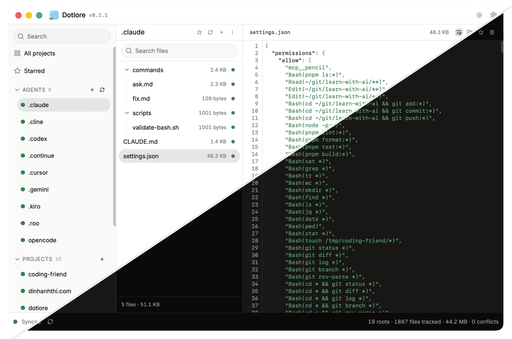

<div align="center">
  
  <h1>Dotlore</h1>
  <p>Sync your AI stuff and keep it away from your main codebase.</p>
  <p>
    <a href="https://dotlore.dinhanhthi.com">Website</a> ·
    <a href="https://github.com/dinhanhthi/dotlore">GitHub</a> ·
    <a href="https://github.com/dinhanhthi/dotlore/releases">Releases</a> ·
    <a href="CONTRIBUTING.md">Contributing</a>
  </p>
</div>

> [!NOTE]
> **macOS** is the current priority. Windows and Linux are coming soon.



Dotlore syncs the AI-agent config your projects git-ignore (`.claude/`, `CLAUDE.md`, `.agents/`, `docs/`, `~/.claude`) between your own Macs. Files stay where they are: nothing is moved, symlinked, or added to your project's git history.

## ✨ Features

- **Files stay put** — never moved, never symlinked, never added to git history.
- **Project folders** — each project is a folder with an include-list of entries to sync.
- **Cloud folder, not a cloud API** — sync through any folder your cloud app keeps in sync: iCloud Drive, Google Drive, Dropbox, OneDrive, Box, MEGA, …
- **Immutable bundles** — each Mac publishes its own git bundle; nothing in the cloud is rewritten.
- **Conflicts without markers** — the newer commit wins; the other version is kept as a sibling file.
- **Desktop + menu bar** — a three-column window and a compact status item.

## 🔄 How it works

Each project gets a private staging git repo under `~/Library/Application Support/dotlore/`. Dotlore copies the include-list into it, commits, and publishes an immutable git bundle to its own device folder in the cloud:

```
<cloud>/dotlore/<slug>/devices/<device-id>/000001.bundle
```

Other devices fetch and merge those bundles with the system `git`. On overlapping edits the newer commit wins everywhere, and the other version is saved as `<stem>.conflict-<device>-<blob>.<ext>`. Nothing is lost and all devices converge.

### ☁️ Cloud folders

Dotlore only needs a folder that a cloud app syncs to every Mac; it never talks to the cloud service itself.

- **Listed automatically** — iCloud Drive, and every account mounted under `~/Library/CloudStorage` (Google Drive, Dropbox, OneDrive, Box, Proton Drive, …).
- **Any other folder** — pick it with "Other…", e.g. a MEGA sync folder or a legacy `~/Dropbox`.
- **Requirements** — the folder must support hard links; FUSE-style drives such as pCloud Drive may refuse to publish, and Dotlore shows the error.
- **Upload status** — the footer's "Synced to cloud" is iCloud-only; other folders show "Synced".

## 🛠️ Tech stack

| Layer  | Technology                                       |
| ------ | ------------------------------------------------ |
| Engine | Rust in `src-tauri/`, driving the system `git`   |
| App    | Tauri 2; React 19 + TypeScript + Vite in `src/`  |
| UI     | Tailwind CSS v4, shadcn/ui                       |
| Editor | CodeMirror 6 (`@codemirror/merge` for conflicts) |

## 🚀 Development

**Prerequisites:** [Rust](https://rustup.rs/) 1.89+, [Node.js](https://nodejs.org/) 20+, [pnpm](https://pnpm.io/), `git`, and the [Tauri prerequisites](https://v2.tauri.app/start/prerequisites/) for macOS.

```bash
pnpm install
pnpm tauri dev          # desktop app
pnpm mockapp:dev        # browser UI with a mocked backend — http://localhost:38422
pnpm test
pnpm format:check
```

> [!TIP]
> `pnpm tauri dev` stores its state in `~/Downloads/dotlore-dev` (override with `DOTLORE_HOME`), so it can run beside an installed copy.
> That also gives it its own device identity, so point it at a separate cloud folder — see [A dev run has its own state directory](CONTRIBUTING.md#a-dev-run-has-its-own-state-directory).

### Cargo build cache

On each new Mac:

1. Create `~/.cargo/config.toml`:

   ```toml
   [build]
   target-dir = ".cargo/shared-target"

   [profile.dev]
   opt-level = 1
   split-debuginfo = "off"

   [profile.dev.package."*"]
   debug = "line-tables-only"
   incremental = false
   ```

2. Delete any old `src-tauri/target` directories.
3. Run `cargo install cargo-sweep`, then `pnpm sweep:cargo` from time to time.

Why, and what each setting does: [CONTRIBUTING.md](CONTRIBUTING.md#cargo-build-cache).

### 📦 Build

```bash
export TAURI_SIGNING_PRIVATE_KEY="$(cat ~/.tauri/dotlore.key)"
export TAURI_SIGNING_PRIVATE_KEY_PASSWORD="…"
pnpm build              # → src-tauri/target/release/bundle/{macos/Dotlore.app, dmg/*.dmg}
```

The signing key is required because the build also produces signed updater artifacts. `pnpm tauri dev` does not need it.

## 🌐 Website

The landing page at [dotlore.dinhanhthi.com](https://dotlore.dinhanhthi.com) is static HTML in [`website/`](website/), deployed on every push to `main`.

## 🤝 Contributing

See [CONTRIBUTING.md](CONTRIBUTING.md) for the invariants the engine depends on.

## 📄 License

[MIT](LICENSE)
